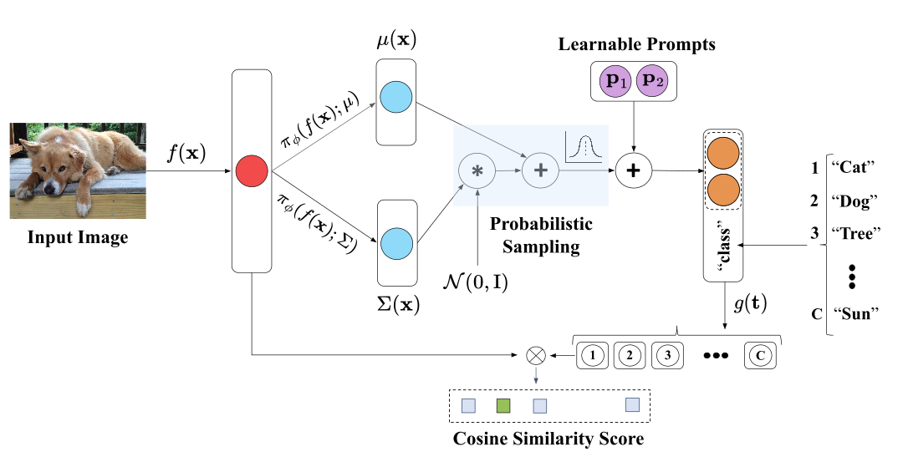

# Variational Prompt Tuning Improves Generalization of Vision-Language Models



This repo contains the codebase of the paper  [Variational Prompt Tuning Improves Generalization of Vision-Language Models](https://arxiv.org/abs/2210.02390). 

## How to Install
This code is built on top of the awesome toolbox [Dassl.pytorch](https://github.com/KaiyangZhou/Dassl.pytorch) so you need to install the `dassl` environment first. Simply follow the instructions described [here](https://github.com/KaiyangZhou/Dassl.pytorch#installation) to install `dassl` as well as PyTorch. After that, run `pip install -r requirements.txt` under `VPT/` to install a few more packages required by [CLIP](https://github.com/openai/CLIP) (this should be done when `dassl` is activated). Then, you are ready to go.

## Dataset Preparation

In this paper, we follow [DATASETS.md](DATASETS.md) to install the datasets. The task definition and few-shot learning setting are similar to following papers for fair comparison:
* [Conditional Prompt Learning for Vision-Language Models](https://arxiv.org/abs/2203.05557), in CVPR, 2022.
* [Learning to Prompt for Vision-Language Models](https://arxiv.org/abs/2109.01134), in IJCV, 2022.

## How to Run

Click a paper below to see the detailed instructions on how to run the code to reproduce the results.

* [Variational Prompt Tuning Improves Generalization of Vision-Language Models](VPT.md)

## Results

The raw numerical results can be found at this [google drive link](https://docs.google.com/spreadsheets/d/e/2PACX-1vSI_8GjWG7gbu_SjqVYfipeDP2ytVaSQqkINU1yEdgFB8gF27FwLXn2E_6c9N7hNWb-o2oB617vifh5/pubhtml).

## Citation
If you use this code in your research, please kindly cite the following papers

```
@article{derakhshani2022variational,
  title={Variational prompt tuning improves generalization of vision-language models},
  author={Derakhshani, Mohammad Mahdi and Sanchez, Enrique and Bulat, Adrian and da Costa, Victor Guilherme Turrisi and Snoek, Cees GM and Tzimiropoulos, Georgios and Martinez, Brais},
  journal={arXiv preprint arXiv:2210.02390},
  year={2022}
}
```
